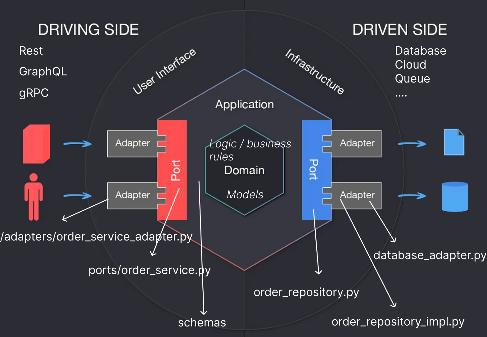
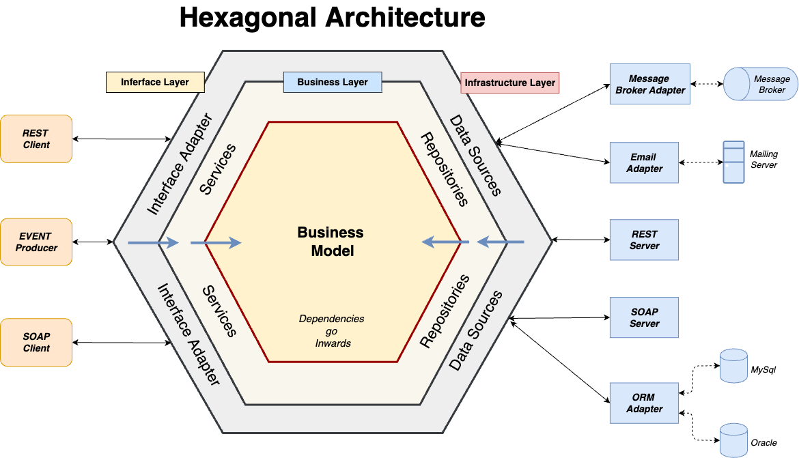

# Arquitetura Hexagonal (Ports and Adapters)

**A Arquitetura Hexagonal, também conhecida como Arquitetura de Ports and Adapters, é um padrão de arquitetura de software que visa promover a independência de diferentes componentes de um sistema e melhorar sua testabilidade e manutenção. Essa abordagem se baseia no princípio de que a lógica de negócios de um aplicativo deve ser o núcleo central, isolado de detalhes técnicos e externos.**

## Princípios Chave:

### Núcleo da Aplicação:
**No centro da arquitetura hexagonal está o "Núcleo da Aplicação". Esse núcleo representa a lógica de negócios do sistema e deve ser independente de qualquer detalhe de infraestrutura ou tecnologia externa. Ele consiste em casos de uso, entidades de domínio e regras de negócios.**

### Ports:
**Os "Ports" são interfaces ou contratos que definem como o núcleo da aplicação interage com o mundo exterior. Isso inclui interfaces para serviços, repositórios, entrada de dados e saída de dados. Essas interfaces são definidas no núcleo da aplicação e não contêm implementações concretas.**

### Adapters:
**Os "Adapters" são implementações concretas das interfaces definidas pelos "Ports". Essas implementações são responsáveis por lidar com detalhes técnicos, como acesso a banco de dados, serviços externos, interfaces do usuário e outros componentes de infraestrutura. Os "Adapters" traduzem as chamadas do núcleo da aplicação para interações com sistemas externos.**

## Vantagens da Arquitetura Hexagonal:

**Testabilidade**: A separação clara entre o núcleo da aplicação e os "Adapters" facilita a escrita de testes unitários e de integração, pois os "Adapters" podem ser substituídos por versões de simulação ou stubs durante os testes.

**Independência**: Tecnológica: Como o núcleo da aplicação não conhece os detalhes dos "Adapters", é possível alterar ou substituir os "Adapters" sem afetar a lógica de negócios.

**Manutenção Simplificada:** A concentração da lógica de negócios no núcleo da aplicação facilita a manutenção e a evolução do sistema, uma vez que as mudanças nos "Adapters" não afetam o núcleo.

## Desafios:

**Complexidade Inicial**: A criação de muitos "Ports" e "Adapters" pode parecer complexa inicialmente, mas os benefícios a longo prazo compensam.

**Overhead de Design**: O design cuidadoso dos "Ports" e "Adapters" é fundamental, pois uma má concepção pode levar a complexidades desnecessárias.

A Arquitetura Hexagonal é uma abordagem valiosa para o desenvolvimento de software robusto e flexível. Ela promove a separação de preocupações, facilita os testes e permite que os sistemas se adaptem a mudanças tecnológicas e de requisitos com mais facilidade.

### Explicando o  projeto:

## Adaptadores (Adapters):
### adapters/:

**_Nessa pasta, você tem os adaptadores que fazem a comunicação entre a sua aplicação e elementos externos, como bancos
de dados ou serviços externos_**

#### `database_adapter.py`: 
- Este é um exemplo de adaptador que se comunica com um banco de dados PostgreSQL usando
SQLAlchemy.
Ele fornece uma camada de abstração para a sua aplicação interagir com o banco de dados sem conhecer os detalhes 
específicos da implementação do banco de dados. Isso permite que você troque o banco de dados sem afetar a lógica
da aplicação.

## Portas (Ports):

### application/ports/:

**_Essa pasta contém as interfaces (portas) que definem os contratos ou contratos que sua aplicação espera que os
adaptadores implementem._**

- order_service.py: Este é um exemplo de uma porta que define um contrato para um serviço de pedidos.
Ele especifica os métodos que qualquer adaptador de serviço de pedidos deve implementar, como a criação de um pedido
ou a obtenção de um pedido.

## Domínio (Domain):

### domain/:

**_Essa pasta contém os modelos de domínio e as regras de negócio da sua aplicação. É o coração da sua aplicação e deve
ser independente de qualquer detalhe de implementação ou tecnologia_**

#### models.py: 
- Este arquivo contém a definição do modelo de domínio Order, que representa um pedido na sua aplicação.
Os modelos de domínio devem refletir as entidades principais do seu domínio e conter apenas lógica de negócios essencial.

## Application (Aplicação):

#### main.py:
- Este é o ponto de entrada da sua aplicação. É onde você configura o servidor FastAPI e define os endpoints da sua API.

#### OrderServiceAdapter:

- Este é um adaptador específico que implementa a porta `OrderService`. Ele atua como uma ponte entre os controladores
(endpoints do FastAPI) e a lógica de negócios da sua aplicação. Ele recebe solicitações dos controladores, interage com
o banco de dados por meio do adaptador de banco de dados e aplica a lógica de negócios necessária.

### Schemas (schemas/order_schemas.py):

_O módulo schemas é responsável por definir as estruturas de dados que representam os objetos de entrada e saída da sua aplicação. Isso inclui a validação dos dados que entram na sua aplicação e a serialização dos dados que saem dela. No seu caso, você tem um arquivo order_schemas.py, que define as seguintes estruturas de dados:_

- `OrderCreateSchema`: 
- -  É uma classe que representa a estrutura de dados para a criação de um pedido. Ela possui dois campos, customer_name e total_amount, que são validados usando o decorador @field_validator. Essa classe é usada como modelo para a criação de pedidos quando você chama a rota create_order.

- `OrderItem`:
- - É uma classe que representa a estrutura de dados de um item de pedido. Ela possui campos como product_name, quantity, price_per_unit, e um campo calculado total_amount usando a propriedade @property. Essa classe é usada quando você chama a rota calculate_order_total para calcular o total do pedido com base nos itens.

- - Essas classes de esquema são úteis para garantir que os dados que entram na sua aplicação sejam válidos e para definir a estrutura dos dados de saída.

### Repositories (repositories/order_repository_impl.py):

- - O módulo repositories é responsável por encapsular a lógica de acesso aos dados. Ele define interfaces e implementações concretas para interagir com o banco de dados ou qualquer outra fonte de dados. No seu projeto, você tem um arquivo order_repository_impl.py, que contém a implementação concreta do repositório de pedidos.

- `OrderRepositoryImpl`:

- - Esta é uma classe que implementa a interface OrderRepository. Ela lida com a persistência de dados relacionados a pedidos, como criar um novo pedido, obter um pedido existente pelo ID e verificar se um pedido existe. Ela usa o SQLAlchemy para interagir com o banco de dados PostgreSQL.

_Portanto, a camada de repositório é responsável por abstrair o acesso aos dados e oferecer uma interface que pode ser usada pelo núcleo da sua aplicação (no centro da arquitetura hexagonal) sem se preocupar com os detalhes de como os dados são armazenados ou recuperados._

_Em resumo, na arquitetura hexagonal, você tem adaptadores que se comunicam com detalhes de implementação externos, 
portas que definem contratos que os adaptadores devem seguir, o domínio que contém a lógica de negócios e os modelos de
domínio, e a aplicação que usa adaptadores e portas para fornecer funcionalidade através de endpoints expostos por um
servidor FastAPI. Isso permite que você isole a lógica de negócios do restante da aplicação e facilmente substitua ou 
estenda componentes sem afetar o núcleo da sua aplicação._

## DDD vs arquitetura hexagonal:

### Domain-Driven Design (DDD):
Foco no Domínio de Negócios: O DDD concentra-se principalmente na modelagem e na representação do domínio de negócios. Ele visa entender profundamente o negócio e mapeá-lo para o código.

Conceitos Chave: No DDD, conceitos como "entidades", "agregados", "repositórios" e "valor de objeto" desempenham papéis cruciais na modelagem do domínio.

Camadas: O DDD não impõe uma estrutura de camadas específica, como a Arquitetura Hexagonal. Em vez disso, ele se concentra em organizar o código em torno do domínio de negócios, usando uma abordagem de "núcleo da aplicação" e "camadas de serviço".

Expressividade do Domínio: No DDD, é comum usar uma linguagem rica e expressiva para descrever o domínio, o que pode resultar em um código mais alinhado com as regras de negócios.

### Arquitetura Hexagonal (Ports and Adapters):
Foco na Arquitetura: A Arquitetura Hexagonal é uma estrutura arquitetural que se concentra na organização do código e na separação das camadas de negócios das camadas de tecnologia.

Ports and Adapters: Ela define uma estrutura de "Ports" (interfaces) e "Adapters" (implementações) para separar as interações do núcleo da aplicação com componentes externos, como bancos de dados, serviços web e interfaces do usuário.

Independência Tecnológica: A Arquitetura Hexagonal promove a independência tecnológica, permitindo que os "Adapters" sejam substituídos sem afetar o núcleo da aplicação.

Facilita os Testes: A separação entre o núcleo da aplicação e os "Adapters" facilita a escrita de testes unitários e de integração.

Complementaridade:
Embora o DDD e a Arquitetura Hexagonal se concentrem em aspectos diferentes (modelagem de domínio vs. organização de código), eles podem ser usados juntos de maneira complementar. Muitos projetos que adotam o DDD também aplicam a Arquitetura Hexagonal para organizar o código e separar as preocupações de infraestrutura.

Em resumo, o DDD é uma abordagem de modelagem de domínio, enquanto a Arquitetura Hexagonal é uma estrutura de organização de código. Ambos são conceitos valiosos para o desenvolvimento de software de qualidade, e sua escolha depende das necessidades específicas do projeto.