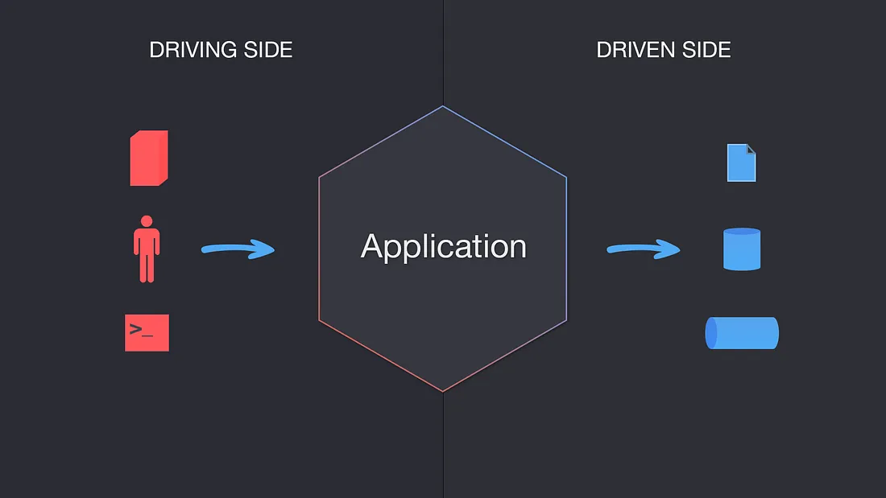
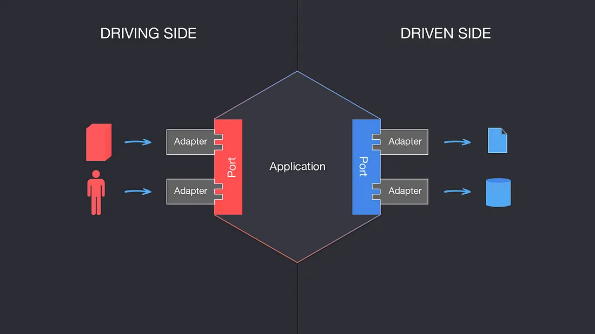

O objetivo das arquiteturas em camadas tradicionais é segregar um aplicativo em diferentes camadas, onde cada camada contém módulos e classes que possuem responsabilidades compartilhadas ou semelhantes e trabalham juntas para executar tarefas específicas.

Existem diferentes tipos de arquiteturas em camadas e não existe uma regra que determine quantas camadas devem existir. O padrão mais comum é a arquitetura de 3 camadas, onde a aplicação é dividida em Camada de Apresentação, Camada Lógica e Camada de Dados.

Em seu livro Domain-Driven Design: Tackling Complexity in the Heart of Software, Eric Evans propõe uma arquitetura de 4 camadas para permitir o isolamento entre a camada de domínio que contém a lógica de negócios e as outras 3 camadas de suporte: interface do usuário, aplicação, e Infraestrutura.

Seguir uma arquitetura em camadas é benéfico de várias maneiras, sendo uma delas a mais importante a separação de preocupações. No entanto, sempre há um risco. Como não existe um mecanismo natural para detectar quando a lógica vaza entre as camadas, pode-se — e provavelmente irá — acabar com salpicos de lógica de negócios na interface do usuário ou preocupações de infraestrutura misturadas à lógica de negócios.

Em 2005, Alistair Cockburn percebeu que não havia muita diferença entre a forma como a interface do usuário e o banco de dados interagem com uma aplicação, uma vez que ambos são atores externos intercambiáveis com componentes semelhantes que interagiriam, de forma equivalente, com uma aplicação. Ao ver as coisas desta forma, pode-se focar em manter a aplicação agnóstica em relação a esses atores “externos”, permitindo-lhes interagir através de portas e adaptadores, evitando assim o emaranhamento e o vazamento de lógica entre a lógica de negócios e os componentes externos.

__A Arquitetura Hexagonal, também conhecida como Portas e Adaptadores, é um padrão de arquitetura que permite que a entrada de usuários ou sistemas externos chegue ao Aplicativo em uma Porta através de um Adaptador, e permite que a saída seja enviada do Aplicativo através de uma Porta para um adaptador. Isso cria uma camada de abstração que protege o núcleo de um aplicativo e o isola de ferramentas e tecnologias externas — e de alguma forma irrelevantes.__

## Ports:

**Podemos ver um Porto como um ponto de entrada agnóstico em termos de tecnologia, pois determina a interface que permitirá que atores estrangeiros se comuniquem com a Aplicação, independentemente de quem ou o que implementará essa interface. Assim como uma porta USB permite que vários tipos de dispositivos se comuniquem com um computador, desde que possuam um adaptador USB. As portas também permitem que o Aplicativo se comunique com sistemas ou serviços externos, como bancos de dados, corretores de mensagens, outros aplicativos, etc.**

### Pro tip: a Port should always have two items hooked to it, one always being a test.

## Adapters:

**Um Adaptador iniciará a interação com a Aplicação através de uma Porta, utilizando uma tecnologia específica, por exemplo, um controlador REST representaria um adaptador que permite a um cliente se comunicar com a Aplicação. Pode haver quantos adaptadores para qualquer porta forem necessários, sem que isso represente um risco para as portas ou para o próprio aplicativo.**

## Application:

O Aplicativo é o núcleo do sistema, contém os Serviços de Aplicativo que orquestram a funcionalidade ou os casos de uso. Ele também contém o Modelo de Domínio, que é a lógica de negócios incorporada em Agregados, Entidades e Objetos de Valor. A Aplicação é representada por um hexágono que recebe comandos ou consultas das Portas, e envia solicitações para outros atores externos, como bancos de dados, também via Portas.

Quando combinado com o Design Orientado a Domínio, o Aplicativo, ou Hexágono, contém as camadas Aplicativo e Domínio, deixando as camadas de Interface do Usuário e Infraestrutura de fora.

## Why a Hexagon?

A ideia de Alistair de usar um Hexágono é meramente ter uma representação visual das múltiplas combinações de Porta/Adaptador que uma aplicação pode ter, e também descrever como o lado esquerdo da aplicação, ou 'lado condutor', tem diferentes interações e implementações em comparação com o lado direito, ou 'lado acionado', falaremos mais sobre isso em um segundo.

## Driving Side vs Driven Side

Os atores condutores (ou primários) são aqueles que iniciam a interação e são sempre representados no lado esquerdo. Por exemplo, um adaptador de acionamento pode ser um controlador que recebe a entrada (do usuário) e a passa para o aplicativo por meio de uma porta.

Atores orientados (ou secundários) são aqueles que são “introduzidos em comportamento” pela Aplicação. Por exemplo, um Adaptador de banco de dados é chamado pela Aplicação para buscar um determinado conjunto de dados da persistência.

Quando se trata de implementação, há alguns detalhes importantes que não devem ser esquecidos:

* As portas serão (na maioria das vezes, dependendo da linguagem escolhida) representadas como interfaces no código.
* Os Adaptadores de Condução utilizarão uma Porta e um Serviço de Aplicação implementará a Interface definida pela Porta, neste caso tanto a interface quanto a implementação da Porta estão dentro do Hexágono.
* Adaptadores acionados irão implementar a Porta e um Serviço de Aplicação irá utilizá-la, neste caso a Porta está dentro do Hexágono, mas a implementação está no Adaptador, portanto fora do Hexágono.

## Inversão de Dependência no Contexto da Arquitetura Hexagonal

O Princípio de Inversão de Dependência é um dos 5 princípios cunhados por (Tio) Bob Martin em seu artigo OO Design Quality Metrics e posteriormente em seu livro Agile Software Development Principles, Patterns and Practices, onde ele o define da seguinte forma:

- High-level modules should not depend on low-level modules. Both should depend on abstractions.
- Abstractions should not depend on details. Details should depend on abstractions.

Como mencionado anteriormente, os lados esquerdo e direito do Hexágono contêm 2 tipos diferentes de atores, Condutores e Conduzidos, onde existem Portas e Adaptadores.

Do lado do Driving, o Adaptador depende da Porta, que é implementada pelo Serviço da Aplicação, portanto o Adaptador não sabe quem irá reagir às suas invocações, apenas sabe quais métodos estão garantidos que estarão disponíveis, portanto depende de um abstração.

No lado Driven, o Serviço de Aplicação é aquele que depende da Porta, e o Adaptador é aquele que implementa a Interface da Porta, invertendo efetivamente a dependência, já que o adaptador de 'baixo nível' (ou seja, repositório de banco de dados) é forçado a implementar a abstração definida no núcleo da aplicação, que é de 'nível superior'.

### Why Should I Use Ports and Adapters?

- Existem muitas vantagens em usar a Arquitetura de Portas e Adaptadores, uma delas é poder isolar completamente a lógica da sua aplicação e a lógica do domínio de uma forma totalmente testável. Como não depende de fatores externos, testá-lo torna-se natural e zombar de suas dependências é fácil.

- Ele também permite que você projete todas as interfaces do seu sistema “por propósito” e não por tecnologia, evitando que você fique preso e facilitando a evolução da pilha de tecnologia do seu aplicativo com o tempo. Se você precisar alterar a camada de persistência, vá em frente. Se você precisar permitir que seu aplicativo seja chamado por bots do Slack em vez de humanos, você conseguiu! Tudo o que você precisa fazer é implementar novos adaptadores e pronto.

- A arquitetura de portas e adaptadores também funciona muito bem com o Domain-Driven Design. A principal vantagem que ela traz é que protege a lógica do domínio contra vazamentos do núcleo do seu aplicativo. Apenas fique atento a vazamentos entre as camadas de Aplicativo e Domínio.